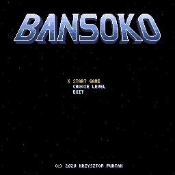
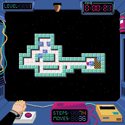
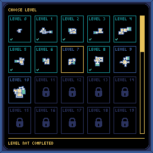
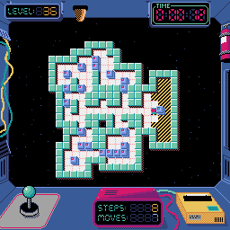
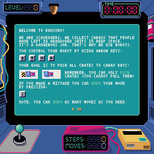
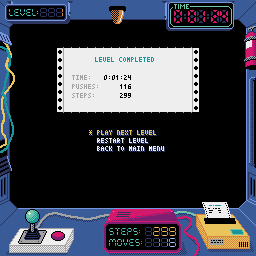

-----------------

**Bansoko** is a space-themed Sokoban clone created in Python using [Pyxel](https://github.com/kitao/pyxel).

> Game story introduction - TBD

  
  

## License

This project is licensed under the MIT License - see the [LICENSE.md](LICENSE.md) file for details
